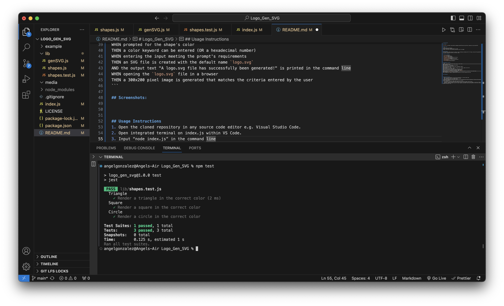
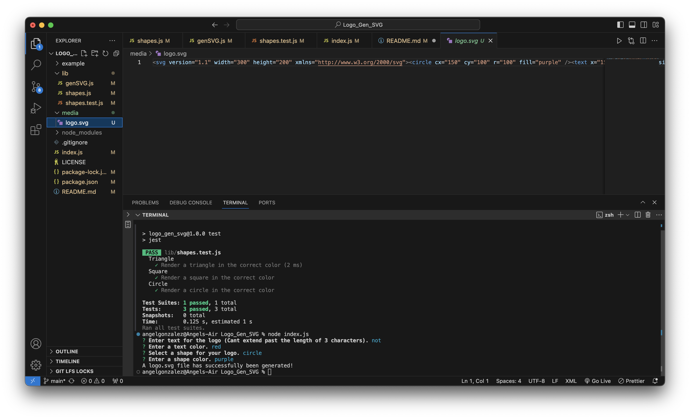
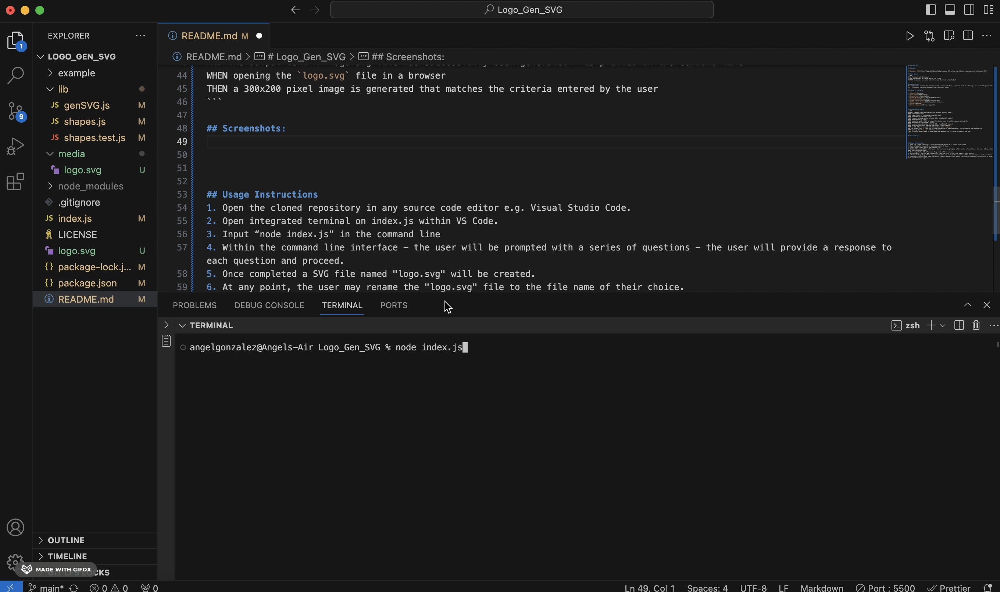

# Logo_Gen_SVG

## License

[](https://opensource.org/licenses/MIT)

## User Story
```md
AS a freelance web developer
I WANT to generate a simple design for a logo 
SO THAT i can save on costs and not exceed the limit of my budget
```

## Description:
The application prompts the user to select a color and shape, providing text for the logo, and saves the generated SVG to a `logo.svg` file which contains the results of the users input. 

## Table of Contents:

- [License](#License)
- [User Story](#User-Story)
- [Description](#Description)
- [Acceptance Criteria](#Acceptance-Criteria)
- [Screenshots](#Screenshots)
- [Demonstration](#Demonstration)
- [Installation](#Installation)
- [Author](#Author)
- [Acknowledgments](#Acknowledgments)


## Acceptance Criteria
```md
GIVEN a command-line application that accepts a users input
WHEN prompted for text
THEN a max limit of 3 characters can be input
WHEN prompted for the text color
THEN a color keyword can be entered (OR a hexadecimal number)
WHEN prompted for a shape
THEN presented with a list of shapes to choose from: triangle, square, and circle
WHEN prompted for the shape's color
THEN a color keyword can be entered (OR a hexadecimal number)
WHEN entering the input meeting the prompt's requirements
THEN an SVG file is created with the default name `logo.svg`
AND the output text "A logo.svg file has successfully been generated!" is printed in the command line
WHEN opening the `logo.svg` file in a browser
THEN a 300x200 pixel image is generated that matches the criteria entered by the user
```

## Screenshots:

### Initiate Test

### Successful Input for Logo

### Newly Designed Logo


## Demonstration: 




## Installation:
```md
1. Open the cloned repository in any source code editor e.g. Visual Studio Code.
2. Open integrated terminal on index.js within VS Code.
3. Input “node index.js” in the command line
4. Within the command line interface - the user will be prompted with a series of questions - the user will provide a response to each question and proceed.
5. Once completed a SVG file named "logo.svg" will be created.
6. At any point, the user may rename the "logo.svg" file to the file name of their choice.
7. (Optional) Regarding future use, you may alter the text of the questions within the index.js to best suit their needs.
8. (Optional) The SVG Logo Maker serves as a basic template that doesnt limit any alterations to the files in order to create the best possible "logo.svg" file.
```

## Author

Follow me on Github at [Utero93](https://github.com/Utero93) Additional questions or concerns? feel free to contact me at angel.m.gonzalez193@gmail.com. 